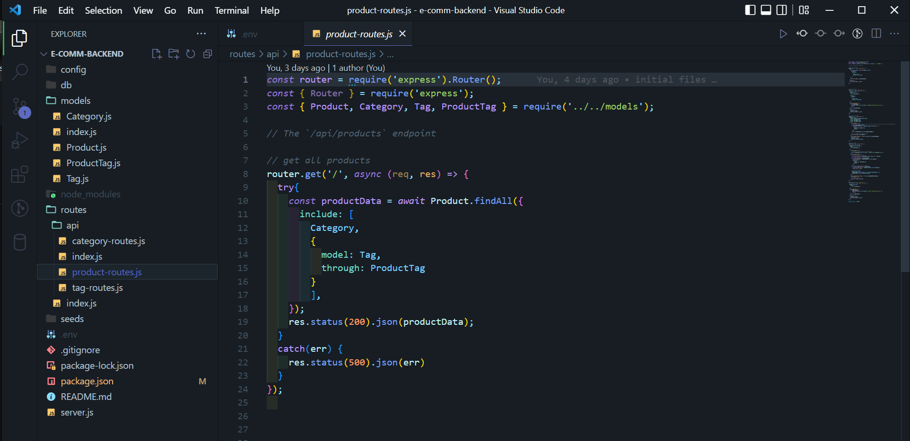

# e-comm-backend  

## Description: 

* The back-end for an e-commerce site built using Express.js, MySQL, and Sequelize

* <a href='https://drive.google.com/file/d/1w89H2gkbcLrHgk61O1enAOrXOc3doCFe/view'>Demonstration Video</a>

## Table of Contents

- [Installation](#installation)
- [Usage](#usage)
- [License](#license)
- [Code Contributors](#code-contributors)
- [Contributing](#contributing)
- [Test](#test)
- [Questions](#questions)

## Installation

* From the command line run: `npm init -y`
*  `npm i express sequelize mysql2 dotenv`
*  Create a .env file in root folder
*  Enter MySQL login credentials in the following format:
*  `DB_NAME='ecommerce_db'`
*  `DB_USER='<username>'`
*  `DB_PW='<password>'`

Back to [top of page](# )

## Usage

* From the command line enter:, `npm run seed`, `npm start`,Routes can be checked using Insomnia

Back to [top of page](# )

## License

* This application is covered under the <a href='https://opensource.org/licenses/MIT'>MIT License</a>.

Back to [top of page](# )

## Code Contributors

#### Made with ❤️ by:

* Brad Dunham

Back to [top of page](# )

## Contributing

Submit an issue

Back to [top of page](# )

## Test

* nah

Back to [top of page](# )

## Questions?

* If you have any questions you can find me here: <https://www.github.com/BDunham484>
* You can also reach me here: bdunham484@gmail.com

Back to [top of page](# )

    
